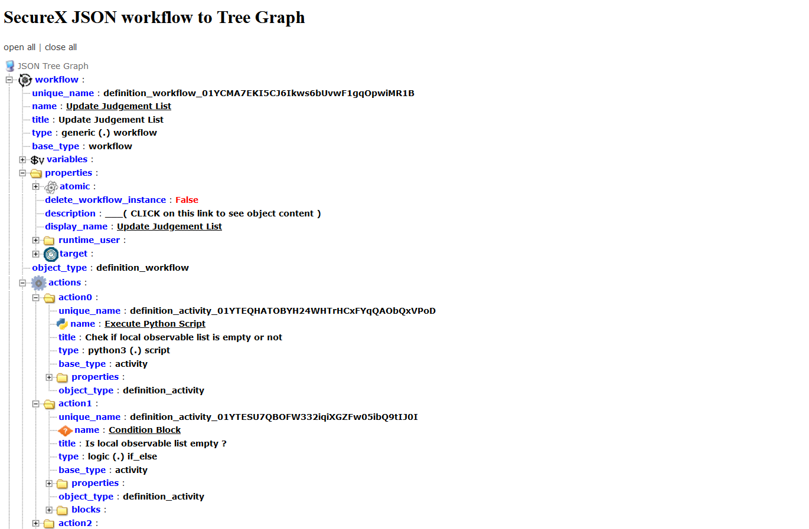

# SecureX JSON workflow parser

This tool is a JSON parser for SecureX Workflow files.

It translates SecureX Workflow JSON files into a clickable Tree view representation that help you to easily understand their structure and how they work.

All workflow contents are represented in the Tree View. Even descriptions and python scripts that can be displayed by clicking on dedicated links. 

## Why this tool ?

The main reason why I wrote this tool was for helping me to easily create worflow documentations based on the instruction [available here](https://ciscosecurity.github.io/sxo-05-security-workflows/content-quality/documentation-template). In order to publish clean Workflows and documentations.

If you have a look to the documentation template you will see all the key information that are expected. Targets, input variables / output variables, subworkflow dependancies...

After having creating a new worklow, the next steps are to clean it up, optimizing it, secure it, Minimize workflow dependancies... 

Identify if we didn't let into it some credentials. Check variable and their scopes, list all the targets and their details. If we put correctly comments and descriptions. etc..etc.. Which 

All this tasks can be done into the workflow editor but personnaly a think the workflow editor is not very user freindly for this. I wanted something that help me to go very fast. Tree View is probably one of the strongest tool for acheiving such goals.

So this tool aims to help you to easily clean, optimize, secure the workflows you might create. In a more easier way than the Workflow editor allows you to do.

In a second hand, the tool help as well to understand how an existing workflow works and do some reverse engineering on it.

## Use SecureX Worflow Analyser first

In this clean up workflow operation, definitely use the [Cisco Workflow Online Tool first](https://ciscosecurity.github.io/sxo-05-security-workflows/analyzer).

This tool highlights all the key points to corrects into your workflows, and gives you recommandations.

These recommandations are best practices, and the tool help to acquire good habits.

Just copy and paste your Workflow JSON content into the textarea box and click on **Analyse**.

## Dependancies

You need to install the 2 following python modules :

- crayons
- ijson

## Installation

Clone the whole content of this repository into your Python Workstation.

    git clone https://github.com/pcardotatgit/SecureX_Workflow_JSON_Tree_viewer.git

Install crayons and ijson 

    pip install crayons
    pip install ijson

And that's it

## Run the application

- Step 1 you must copy and paste the SecureX JSON workflow export into the  **sxo_json_workflow** subfolder. This subfolder is supposed to contains only one JSON file. If several JSON files are located into this subfolder, only the last one will be computed.
- Step 2 Open a console terminal and go to the application directory into your laptop
- Step 3 run the **1-sxo_json_workflow_to_tree.py** script

.

    python 1-sxo_json_workflow_to_tree.py

## Result

The resulting file is the index.html file located into the **result** subfolder.

    ./result/index.html   just open it with your browser

Open it with your browser and the Tree Graph will appear 

The Tree View is a clickable graph. You can browse the whole tree

## What's Next ?

Generate automatically the markdown documentation for Workflow submission to Cisco